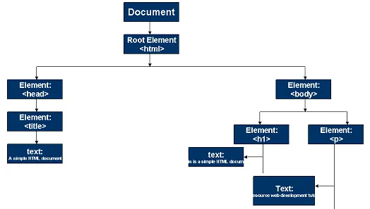

# Manipulación del DOM con JavaScript

---
## 01 - DOM (Document Object Model)

El DOM ó *Modelo de Objetos del Documento* es una interfaz de programación de aplicaciones (API) para documentos válidos HTML.  

De forma más general, podemos decir que el DOM es la estructura de un documento HTML, formado por etiquetas HTML y sus características, a las que podemos "*acceder*" para pdoer manipular su estructura o comportamiento mediante el uso de JavaScript.  

Esta estructura tiene un nivel "*jerárquica*". Por ello, es común escuchar el término "*árbol de DOM*", que no es más que una referencia de la estructura jerárquica de los elementos del DOM. Del elemento *principal* (el elemento raíz **document**) se desperenden los elementos subsecuentes. Siguiendo entonces, la etiqueta `<html></html>`, que a su vez contiene dos eiquetas: `<head></head>` y `<body></body>`, `head` contiene a su vez otras etiquetas y `body` contiene a otras etiquetas. Esta estructura base la podemos visualizar en la siguiente imagen:  
<br>


Por supuesto que esta es una estructura muy básica, pero nos da la idea de como es que nuestro documento HTML puede ir creciendo y la estructura que se generará a partir de la adición de más elementos HTML.  

Es importante hacer notar que cada elemento o etiqueta HTML tiene sus propios atributos (clases, id's, valores, etc.) y contenido (texto generalmente), de esta manera vamos a tener varias características con las cuales podremos acceder a determinado elemento y poderlo manipular de acuerdo a las necesidades mediante JavaScript. Lo más habitual es hacer uso de los identificadores (`id`) o *data attributes* para acceder a un elemento en espcífico y evitar duplicidad o redundancias con el acceso a otros elementos.

Para profundizar un poco más sobre los *data attributes* puedes consultar la documentación de MDN [aquí](https://developer.mozilla.org/es/docs/Learn/HTML/Howto/Use_data_attributes)

<br>

---
## 02 - Acceso a elementos del DOM

Ahora que ya sabemos que dentro de un documento HTML existe un aestructura jerárquica de todos los elementos que lo componen, ahoro vamos a ver como podemos acceder a ellos mediante el uso de JavaScript.  

Lo primero es saber que para poder acceder a un elemento HTML, lo primero es "*entrar*" al documento en sí, es decir, debemos iniciar nuestra "*búsqueda*" en el elemento raiz, en este caso el elemento principal (también llamado elemento *padre*): `document`.  

Después, una de las formas más utilizadas es hacer uso de *id's*, ya que los id's, sólo se pueden definir y usar de forma específica en un único elemento, esto es: si definimos `id=mainText` a una etiqueta `p` de la siguiente forma:
```html
<p id="mainText">Main section text</p>
```
No será permitido el uso de este id en otro elemento, por lo que nos aseguramos que este id es único y por lo tanto estaremos accediendo a un único elemento. en caso de que por error asignemos un mismo id a más de un elemento HTML, generarenmos un error al momento de definirlo o intentar usarlo.  

Ahora bien, mediante el uso de JavaScript, podemos hacer lo siguiente para almacenar el elemento (incluyendo atributos y contenido) en una variable (regularmente *constante*):
```javascript
const paragraph = document.getElementById("mainText")
```
En la línea de código anterior, estamos accediento al elemento que tiene como atributo el id "mainText" y lo almacenamos en la constante *paragraph*. Ahora con esto podemos hacer uso de la programación para realizar las manipulaciónes que se requieran.  

Como ya vimos, para acceder a un elemento del DOM, podemos hacer uso del método: `.getElementById()`, donde el parámetro que recibe es el nombre del *id* definido en nuestra etiqueta HTML. Pero existe otras formas/métods para acceder a un elemento de nuestro documento, entre los más utilizados estan:
1. `.getElementByClassName("nameClass")`
2. `.querySelector("attrValue")`

Un inconveniente que puede sucitarse al trabajar con otros desarrolladores, es que, si por una u otra razón, se cambian el nombre del *id* (o cualquier otro atributo que se esté utilizando para nuestro JavaScript), nuestro código va a fallar debido a que la referencia a determinado elemento ya no existe. Entonces una forma de solucionar esto es mediante el uso de los *data attributes*, que nos serviran para "*marcar*" cada uno de nuestros elementos para poder acceder a ellos desde JavaScript. Aunque, si no tenemos cuidado, podremos tener conflictos de duplicidad y obtener resultados inesperados en nuestro programa.  

Para establecer un data attribute dentro de un elemento HTML, hacemos uso del prefijo: `data-`. Después del guión, podemos definir el texto que necesitemos. Siguiendo con el ejemplo anterior, podemos hacer lo siguiente:
```html
<p id="mainText" data-main-text>Main section text</p>
```
Observamos que definimos `data-main-text`, el cual es el *data attribute* que utilizaremos en JavaScript para acceder a este elemento, por lo que de:
```js
const paragraph = document.getElementById("mainText")
```
pasamos a esto:
```js
const paragraph = document.querySelector("[data-main-text]")
```
En este caso hicimos uso del método `.querySelector()`, ya que accederemos al elemento cuyo valor contenga la definición del parámetro pasado, en este caso: `"[data-main-text]"`  
<br>

---
## 03 - Escuchando *eventos*

Una parte fundamental de la manipulación de los elementos del DOM, es poder saber cuando el usuario esta interactuando de alguna forma con nuestro documento HTML. Para ello existe la función `addEventListener("event", callBack())`. esta ´funciónrecibe dos parámetros, en primer lugar el evento que queremos detectar y el segundo parámetro una función (denominada de *call back*) que ejecutará las instrucciones definidas.  

Algunos de los eventos de los que dispone el DOM son:
1. `click`
2. `focus`
3. `keydown`
4. `mouseenter`
5. `scroll`  

Existen muchos más, pero para una referencia más completa, puedes revisar la documentación de MDN [aquí](https://developer.mozilla.org/es/docs/Web/Events)  
<br>

---
## 04 - Aplicando la teoría

Para revisar lo que se detalló anteriormente, puedes acceder a una pequeña demostración con un ejemplo real de la *manipulación* de los elementos del DOM en el siguiente [directorio](./project/)